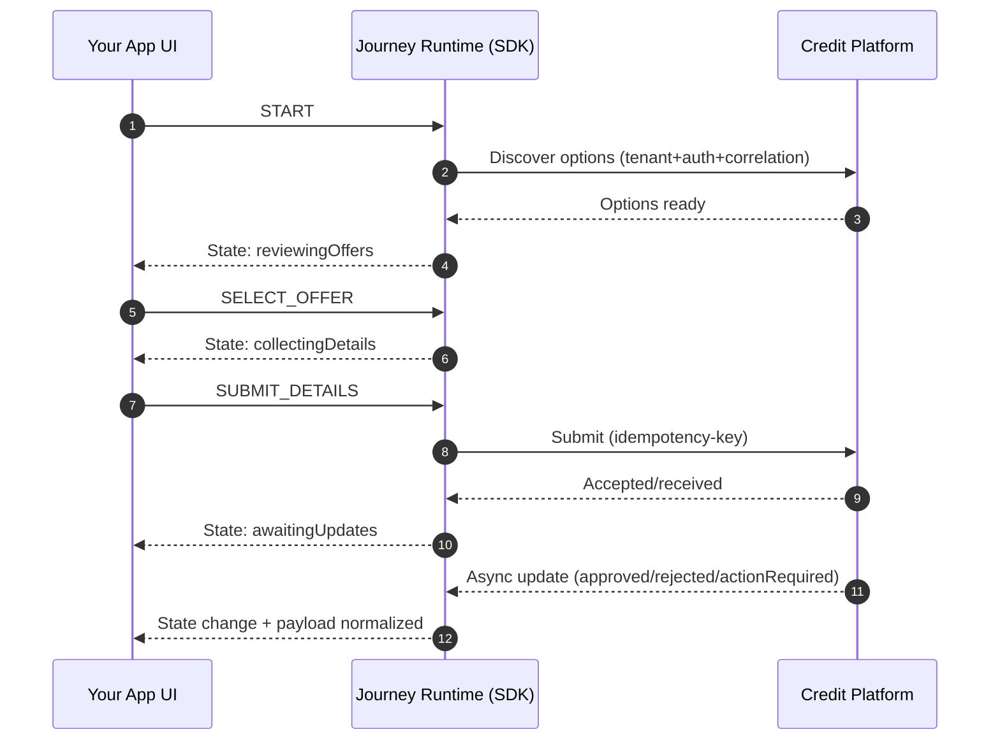

## Asynchronous updates: how the journey keeps moving

Most credit workflows cannot complete within one synchronous request.

The SDK is designed to support multiple update channels and normalize them into the same journey events:

* polling (periodic status checks)
* push updates (SSE/WebSocket) where applicable
* backend callbacks routed through your infrastructure (hybrid model)

### High-level sequence (illustrative)

**What this “sells” in production terms:**

* Your UI never “guesses” what to do next.
* Your app gets a single stream of truth: **current state + next expected actions**.
* Async updates are not special-case code paths; they are first-class.
