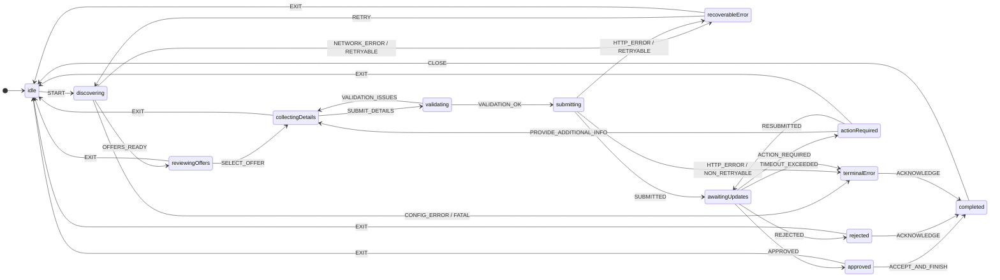

## Journey states and transitions (illustrative)

> The exact state names and screens may evolve, but the structure is stable: **user actions and platform updates cause a journey to advance**.

### How to read this (non-technical version)

* The user **sees screens** that match the current state (offers, forms, progress, result)
* The journey advances when:

  * the user takes an action (select, submit, retry, exit), or
  * the platform sends updates (approved, rejected, action required)
* The SDK provides consistent handling for:

  * temporary failures (recoverable)
  * permanent failures (terminal)
  * leaving and resuming later
