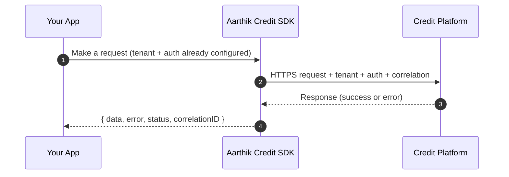

## Reliability & observability

The SDK treats production concerns as first-class features.

### Built-in behaviors

* **Timeouts**

  * Default timeout per request (configurable)
  * Per-request override supported

* **Retries**

  * Conservative defaults; retries are opt-in via configuration
  * Exponential backoff with jitter to reduce retry storms

* **Idempotency keys**

  * You can supply an `idempotencyKey` for non-GET operations
  * Helps prevent duplicate “create” operations in retry scenarios

* **Correlation IDs**

  * Every request includes a correlation ID you can log and trace
  * The SDK returns the correlation ID in its response payload for easy logging

* **Cancellation**

  * `AbortSignal` support for route changes, user cancel, or query cancellation

### Default headers (can be customized)

| Concern     | Default header                     | Purpose                                         |
| ----------- | ---------------------------------- | ----------------------------------------------- |
| Tenant      | `x-tenant-id`                      | Tenant scoping                                  |
| Auth        | `authorization` (`Bearer <token>`) | Access control                                  |
| Correlation | `x-correlation-id`                 | Traceability                                    |
| Idempotency | `idempotency-key`                  | Safe writes                                     |
| Client info | `x-client-info`                    | Debug/analytics without relying on `User-Agent` |

### Request lifecycle (high-level)

